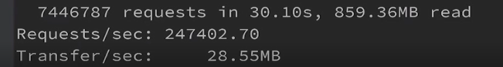

# 高并发go语言实现的商品秒杀系统

---

## 项目介绍

###项目架构
该项目采用iris的go web框架，并进行前后端分离，采用MVC的架构，采用RabbitMq的消息队列进行消息的处理

---

### 开发流程
>创建backend文件夹储存后端的一些接口采用MVC架构构建出datamoudles文件夹在backend目录下创建web目录里面是一些前端的assets文件还有控制器和视图文件夹。
> 同样前端的fronted文件下也是相同的目录架构，repositories则是商品、订单、用户的一些功能实现，service文件夹则是封装的功能实现提供的一些接口
>后期的时候对于项目的优化，采用RabbitMq消息队列来进行生产优化用一个结构体来储存商品的id，用户id，然后用消息的方式写入队列中然后进行分布式验证，必须登录才能进行商品的购买
> 在消息队列中高并发采用协程处理商品订单的添加，和购买之后商品数量的删除
> 
> 
> 
> 
> 
---

### 需求确定
>项目主要是高并发的秒杀需要处理大量的数据以及接受大流量的访问，基础的商品需求是商品的添加， 商品的删除，更新，将购买的商品添加到订单当中
>用户登录还需要一些用户的删除，添加，获取用户信息，定位到每个商品，订单和用户就需要添加根据各个品类的id获取具体的商品之类的
> 在用户登录成功前需要进行cookie验证使用拦截器进行拦截采用hash一致算法进行均衡负载进行分布式验证
---

###开发环境搭建
>开发环境的搭建 是在一个虚拟机centos7下完成的数据库的操作，rabbitmq消息队列的生产，数据库采用的是mysql
>前端用户的操作是在windows10下进行

---

### 开发与测试

用productNum来储存商品数量加锁来处理并发问题
getOne.go进行压测
在以下三种条件进行压测

1.八十线程下 200连接数 30秒

2.八十线程 2000个连接 30秒

3.八十线程 20000个连接 30秒

---

###实战项目功能介绍
>采用MVC架构实现高并发的秒杀系统，拥有用户登录界面采用hash一致算法进行用户的cookie登录利用rabbitmq消息队列减轻mysql数据库的操作存储压力
> 实现了商品的添加根据商品id查询商品，根据商品id删除商品，订单的增加， 订单的删除，利用消息队列将生产消息含有商品id和用户id，将订单的生产和删除通过消息队列
> 产生的消息进行匹配，启用协程高并发的进行订单的创建，和商品数量的及时更新，用统一拦截器对每个接口进行拦截验证采用分布式验证每个用户，不是登录用户进行页面的跳转，进行登录跳转界面
> 用户登录验证成功，密码采用aes进行加密。
---

### 项目效果
>1.商城主页

> 2.用户注册界面

>3.登录界面

